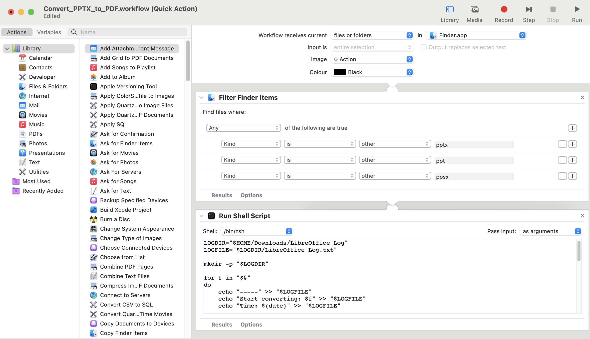
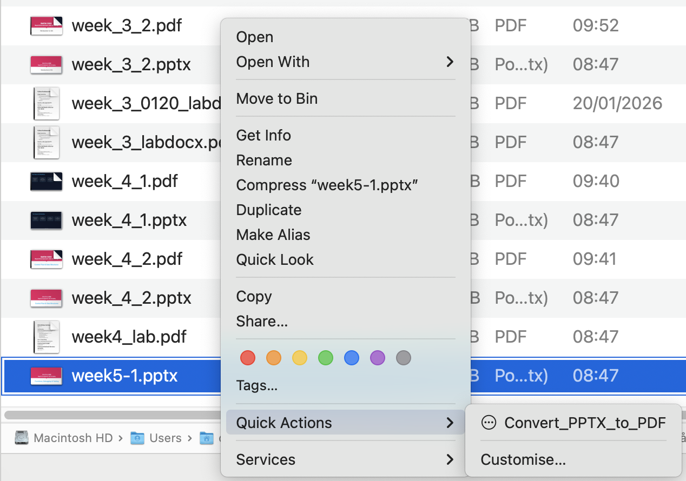
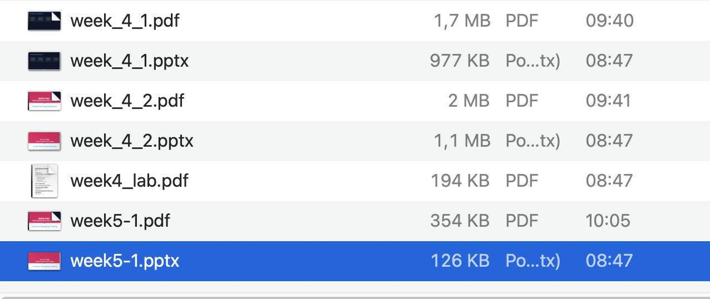
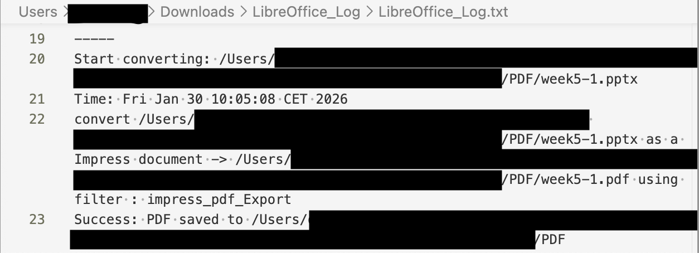

# PPTX → PDF Converter (Automator + LibreOffice)

Some teachers provide lecture materials in **PPTX- format**, which my favorite note *Obsidian* does not support.
Opening PowerPoint every time just to export a PDF is inconvenient.

There is a way to **convert pptx to pdf via terminal** (using **LibreOffice**). This conversion requires only one command:

```bash
/Applications/LibreOffice.app/Contents/MacOS/soffice --headless --convert-to pdf "./this-file.pptx"
```

It is easy, but I prefer the "Right‑click" way. So I created a
**Quick Action PPTX-PDF Converter** by using Automator.

The conversion runs in headless mode and requires no GUI interaction.

## Features

- Right‑click any `.pptx` file → **Quick Action**s → instantly convert to PDF
- **On success**: Finder automatically opens the folder containing the generated PDF
- **On failure**: Finder opens the log folder (`~/Downloads/LibreOffice_Log`)
- All logs are appended to:
  `~/Downloads/LibreOffice_Log/LibreOffice_Log.txt`
- No macOS notifications (see explanation below)

## Requirements

- macOS
- LibreOffice (7.x recommended)
- Automator (built‑in macOS app)
- LibreOffice may require **Full Disk Access** on Mac.

## HOW TO?

Follow these steps to convert PPTX files to PDF directly from Finder.

### 1. Automator Workflow Setup

Create a Quick Action that runs LibreOffice in headless mode.

- `Filter Finder Items` →  pptx
- `Run Shell Script` → add the scripts



### 2. Right‑click the PPTX file

Right‑click the `.pptx` file you want to convert and choose the Quick Action you created.



### 3. On Success

LibreOffice generates the PDF in the background, and
**Finder automatically opens the folder containing the PDF.**



### 4. On Failure

If an error occurs,
**the log folder (~/Downloads/LibreOffice_Log) opens automatically.**

You can check the `LibreOffice_Log.txt` file for details.



## Considerations

### Notification feature removed

Initially, I implemented macOS notifications for success/failure.
However, macOS has strict limitations:

- Using `display notification`
  → Clicking “Show” **always opens Script Editor**
- Notifications **cannot be made non‑clickable**
- Notification click actions **cannot be customized**

These behaviors are macOS system limitations and cannot be bypassed.

Therefore, I removed notifications and replaced them with:

- **Success** → Automatically open the folder containing the PDF
- **Failure** → Automatically open the log folder

This provides a smoother and more predictable workflow.

#### If you still want notifications

You can add a notification like this:

```zsh
osascript -e "display notification \"PDF created\" with title \"LibreOffice Success\" subtitle \"$(basename "$f")\""
```

But clicking the notification will always open Script Editor.

---

## Script Used

```zsh
# Path to the log directory
LOGDIR="$HOME/Downloads/LibreOffice_Log"

# Path to the log file
LOGFILE="$LOGDIR/LibreOffice_Log.txt"

# Create the log directory if it does not exist
mkdir -p "$LOGDIR"

# Process each file passed from Automator
for f in "$@"
do
    echo "-----" >> "$LOGFILE"
    echo "Start converting: $f" >> "$LOGFILE"
    echo "Time: $(date)" >> "$LOGFILE"

    # Folder where the original file is located
    dir=$(dirname "$f")

    # Run LibreOffice in headless mode
    /Applications/LibreOffice.app/Contents/MacOS/soffice \
        --headless --convert-to pdf --outdir "$dir" "$f" \
        >> "$LOGFILE" 2>&1

    # Check exit status
    if [ $? -eq 0 ]; then
        echo "Success: PDF saved to $dir" >> "$LOGFILE"
        open "$dir"      # On success: open the PDF folder
    else
        echo "ERROR: Conversion failed for $f" >> "$LOGFILE"
        open "$LOGDIR"   # On failure: open the log folder
    fi

    echo "" >> "$LOGFILE"
done
```

□■□■□■□■□■□■□■□■□■□■□■□■□■□■□■□■□■□■□■□■□■□■□■□■□■□■□■□■□■□■

# PPTX → PDF 変換（Automator + LibreOffice）

PPTX 形式を毎回 PowerPoint などのアプリを開いて PDF に変換するのが面倒だったため、解決方法を探した。

LibreOfficeを使って、ターミナルで変換する場合は

```bash
/Applications/LibreOffice.app/Contents/MacOS/soffice --headless --convert-to pdf "./this-file.pptx"
```

でOK。

ただ、右クリックで楽に変換したかったので、**Finder の右クリックだけで PDF に変換できる Automator クイックアクション**を作成。

## 特徴

- Finder で `.pptx` を右クリック → クイックアクション → 即 PDF 変換
- **成功時**：PDF が保存されたフォルダを Finder で自動的に開く
- **失敗時**：ログフォルダ（~/Downloads/LibreOffice_Log）を自動で開く
- ログはすべて `~/Downloads/LibreOffice_Log/LibreOffice_Log.txt` に追記
- 通知センターは使用しない（理由は後述）

## 必要環境

- macOS
- LibreOffice（7.x 推奨）
- Automator（macOS 標準アプリ）

## HOW TO?

### 1. Automator でワークフローの構成

LibreOffice を headless モードで実行するクイックアクションを作成。

- 「Finder 項目をフィルタ」を選択して、pptxを指定
- 「シェルスクリプトを実行」を選択して、後述の使用スクリプトを入力


### 2. Finder で PPTX を右クリック

変換したい `.pptx` ファイルを右クリックし、
作成したクイックアクションを選択。


### 3. 変換成功時

LibreOffice がバックグラウンドで PDF を生成し、
**PDF が保存されたフォルダが自動で開かれる。**


### 4. 変換失敗時

エラーが発生した場合は、
**ログファイル `LibreOffice_Log.txt` のあるフォルダ（~/Downloads/LibreOffice_Log）が自動で開かれる。**


## 作成の過程で考慮したこと

### 通知機能は諦めた(T ^ T)

当初は通知センターに「成功」「失敗」を表示する機能を付けていたが、
macOS の仕様により次の問題が発生した：

- `display notification` を使う限り
  → 通知の「Show」やクリックは **必ず Script Editor を開く**
- macOS の通知は **クリック不可にできない**
- 通知クリック時の動作を **指定することもできない**

これらは macOS の仕様であり回避不能ということが判明。

そのため通知機能は廃止し、
**成功時は PDF のあるフォルダを自動で開く**
**失敗時はログフォルダを開く**
という方式に変更。

#### それでも通知機能を使いたい場合

以下のようなコードを使えば通知は出せる。
ただし、クリック時に Script Editor が開く問題は解決できないので注意。

```zsh
osascript -e "display notification \"PDF を作成しました\" with title \"LibreOffice 変換成功\" subtitle \"$(basename "$f")\""
```

## 使用スクリプト

```zsh
# ログフォルダのパス
LOGDIR="$HOME/Downloads/LibreOffice_Log"

# ログファイルのパス
LOGFILE="$LOGDIR/LibreOffice_Log.txt"

# ログフォルダがなければ作成
mkdir -p "$LOGDIR"

# Automator から渡されたファイルを順番に処理
for f in "$@"
do
    echo "-----" >> "$LOGFILE"
    echo "Start converting: $f" >> "$LOGFILE"
    echo "Time: $(date)" >> "$LOGFILE"

    # 元ファイルのフォルダ
    dir=$(dirname "$f")

    # LibreOffice を headless モードで実行
    /Applications/LibreOffice.app/Contents/MacOS/soffice \
        --headless --convert-to pdf --outdir "$dir" "$f" \
        >> "$LOGFILE" 2>&1

    # 成功判定
    if [ $? -eq 0 ]; then
        echo "Success: PDF saved to $dir" >> "$LOGFILE"
        open "$dir"      # 成功時：PDF のあるフォルダを開く
    else
        echo "ERROR: Conversion failed for $f" >> "$LOGFILE"
        open "$LOGDIR"   # 失敗時：ログフォルダを開く
    fi

    echo "" >> "$LOGFILE"
done
```
